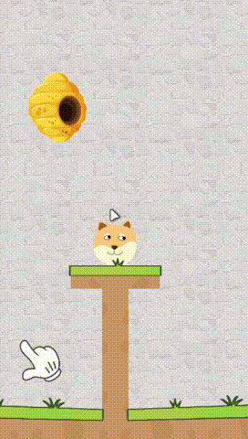

# 救救小狗头

`该项目暂时未开发完成！`

### 项目概述
哦不，小狗头马上就要被一群愤怒的蜜蜂攻击了！快画一条拥有物理效果的线条挡住蜂群的疯狂进攻，拯救我们可怜的小狗头! 

 
 

这是一个由Unity制作的2D游戏，使用的Unity编辑器版本为 [2022.3.20f1](https://unity.com/releases/editor/whats-new/2022.3.20#notes) 。

### 项目技术点
- 支持键鼠、触屏 ~~以及手柄~~ 输入
- 支持资源与Lua脚本的热更新，支持从远端服务器比较及更新资源
- 确保在不同渲染画面比例下，能够完整渲染整个设计的游戏区域的2D自适配相机
- 支持在不同的设备下，适配显示安全区的UI自适应系统，支持用户对相关数值进行自定义设置

### 使用的第三方内容
本仓库包含来自第三方的内容。  
**这些第三方内容的授权信息与本仓库的授权协议不同，请务必参考这些内容的所有者提供的授权说明。**  

如果您需要获取、修改、分发以及使用本仓库项目，请遵守第三方内容的授权协议或自行剔除相关内容。
如因您违反第三方内容的授权协议或未剔除本仓库内包含的第三方内容而引起的任何纠纷，本仓库及原作者不对此负责，且不承担任何因此产生的法律责任。
  
如果您发现本仓库使用了您的内容且未在此标注，请联系我们。  
如果您是第三方内容的所有者且不同意本仓库使用您的内容，请联系我们，我们会第一时间移除相关内容。  
  
详细信息请参见 [使用的第三方内容说明](Third-Party.md) 文档。 

### 额外说明
- 本项目原则上仅供学习及参考用途，详细的授权信息请参考[授权说明](LICENSE.md)。
