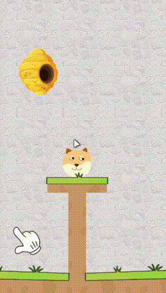

# 救救小狗头

（此文档仍在编写中...）
### 项目概述
哦不，小狗头马上就要被一群愤怒的蜜蜂攻击了！快画一条拥有物理效果的线条挡住蜂群的疯狂进攻，拯救我们可怜的小狗头! 

 

游戏示例 

 

这是一个由Unity制作的2D游戏，使用的Unity编辑器版本为 [2022.3.20f1](https://unity.com/releases/editor/whats-new/2022.3.20#notes) 。

### 项目技术点
- 支持键鼠、触屏以及手柄输入（也可能不支持...）
- 支持资源与Lua脚本的热更新，支持从远端服务器比较及更新资源
- 确保在不同渲染画面比例下，能够完整渲染整个设计的游戏区域的2D自适配相机
- 支持在不同的设备下，适配显示安全区的UI自适应系统，支持用户对相关数值进行自定义设置

### 使用的第三方内容
此项目仅供学习及参考用途。 

任何其他个人或组织使用此项目进行盈利行为，均与本仓库及其原作者无关，本仓库和其原作者不承担任何法律责任！  

如果您是第三方内容的创造者且不同意本仓库使用您的内容，请联系我们，我们会第一时间移除相关内容。   

- 使用的第三方内容  

  |资源文件|类型|来源|
  |:-:|:-:|:-:|
  |单元格|音频|s|
  |单元格|音频|s|
  |单元格|音频|s|

- 使用的第三方库或工具
  - [**Xlua**](https://github.com/Tencent/xLua)
  - [**NewtonSoft Json**](https://www.newtonsoft.com/json)
  - [**AssetBundle Browser**](https://github.com/Unity-Technologies/AssetBundles-Browser)

如果您发现本项目使用了您的内容且未在此标注，请联系我们。

### 额外说明
- 本项目仅供学习及参考用途，详细的授权信息请参考[授权说明](LICENSE.md)。